<!--
- 🐙 [Website](https://prothegee.com)
- 🐘 [Artstation](https://www.artstation.com/prothegee)
-->

# Profile

*Systems Thinking | Software Engineer*

```
Senior Software Engineer | 7+ yrs production systems. Event-driven specialist:
Kafka WebSocket pipelines (< 50ms), idempotency, backpressure handling. Owned
99.9% SLOs, graceful degradation patterns. Led 5 pods, raised code review
bars, cut onboarding 50%. Polyglot: C++/Go/JS. SQL+NoSQL (Postgres/ScyllaDB/
Redis). ADRs/RFCs documented. Built local LLM moderation, crypto libraries.
Pragmatic scale.
```

---

__*protégé*__
```
- One who is under the care and protection of another.
- A person who is guided and supported by an older and more experienced person or mentor.
```

---

## __*Portfolio & Key Technical Project Case Studies:*__

###### > *click to open*


<details close>
<summary>HTTP Server Design in Zig (Three Concurrency Models)</summary>

<br>

• Designed three minimal HTTP server versions in Zig with identical routing: single-threaded (54k req/s), thread-per-connection (254k req/s), and worker pool with multiple acceptors (248k req/s, 5× lower latency than v2).

• Engineered a fixed-size thread pool with per-CPU acceptor threads using SO_REUSEPORT, eliminating per-connection thread churn while maintaining throughput.

• Quantified trade-offs: v2 suits most balanced workloads; v3 delivers 38.9µs avg latency for latency-sensitive services.

<br>

Source Code & Documentation: https://github.com/prothegee/http-server-design-architect-in-zig

</details>

<br>

<details close>
<summary>On-Site Campaign Activation System (IoT & Real-Time Data)</summary>

<br>

• Designed end-to-end architecture for a high-traffic marketing campaign integrating physical IoT vending machines with digital user experiences.

• Authored comprehensive HLD and LLD documents defining strict API contracts, WebSocket geofencing logic, and session security protocols.

• Mitigated third-party integration risks by implementing "defensive interfaces" and mock services for undocumented client/IoT systems ("Grey Areas"), ensuring zero development blockers.

<br>

Source Code & Documentation: https://github.com/prothegee/server-backend-audio_transcriber-go

</details>

<br>

<details close>
<summary>AI-Powered Real-Time Audio Moderation System</summary>

<br>

• Engineered a Go-based gRPC server integrating whisper.cpp (GGML) models for on-device speech-to-text, ensuring low-latency processing without external API dependencies or data privacy risks.

• Designed a thread-safe worker pool pattern to manage non-thread-safe C++ AI libraries within Go, optimizing throughput while maintaining system stability under high load.

• Demonstrated a viable solution to reduce platform ban risks by ~90% through early keyword detection, translating complex ML capabilities into actionable business protection.

<br>

Watch Demo: https://youtu.be/IwSptYtNRzM

Source Code & Documentation: https://github.com/prothegee/server-backend-audio_transcriber-go
</details>

<br>

<details close>
<summary>IP-Based Rate Limiter for HTTP/gRPC Servers</summary>

<br>

• Implemented reusable rate-limiting middleware for both net/http (Go stdlib) and gRPC (google.golang.org/grpc), ensuring consistent traffic governance across service boundaries with minimal external dependencies.

• Designed JSON-based configuration loading for dynamic adjustment of thresholds (max requests/IP, time window, cleanup intervals) without code redeployment, supporting rapid environment adaptation.
    
• Engineered goroutine-based cleanup routine to prune stale IP entries, preventing memory leaks during long-running operations while maintaining O(1) lookup performance for active rate-limit checks.

<br>

Source Code & Documentation: https://github.com/prothegee/network-limiter-go

</details>

<br>

<details close>
<summary>Domain-Driven Backend Service with Real-Time Kafka/WebSocket Integration</summary>

<br>

• Applied Domain-Driven Design (DDD) principles to structure business logic, ensuring clear separation between domain models, application services, and infrastructure layers for long-term maintainability.

• Built bidirectional communication flow using Apache Kafka as event backbone and WebSocket endpoints (/ws/stock/trade) for low-latency client updates, enabling live trade data streaming with backpressure handling.

• Implemented comprehensive test suites following TDD methodology, achieving high coverage for critical paths including Kafka producers, WebSocket handlers, and database interactions.

<br>

Watch Demo: https://youtu.be/TvGujQngAJ0

Source Code & Documentation: https://github.com/prothegee/server-backend-go

</details>

<br>

<details close>
<summary>Full-Stack Real-Time Chat Application (Rails + Vue)</summary>

<br>

• Connected Vue frontend to Rails ActionCable backend using standardized subscription protocol, enabling bidirectional real-time messaging with room-based isolation and immediate message broadcasting to all connected clients.

• Established consistent message schema between backend (Ruby hash) and frontend (TypeScript interface) with runtime validation on both ends, reducing integration bugs and improving developer velocity.

• Designed file-based message persistence (chat_data.json) and minimal Rails setup to eliminate database configuration overhead, allowing focus on core WebSocket logic and UI/UX iteration during early development phases.

<br>

Source Code & Documentation: https://github.com/prothegee/chat_app-ruby-vue

</details>

<br>

<details close>
<summary>High-Performance Full-Stack Content Management Platform</summary>

<br>

• Leveraged Dragon Framework (C++) to deliver low-latency HTTP services optimized for data-intensive operations, demonstrating suitability for streaming workloads and backend-heavy applications with Kafka integration pathways.

• Developed interactive dashboard using Spel framework with real-time content rendering, enabling instant reflection of backend updates through simple HTTP GET calls without complex client-side state management.

• Implemented CRUD operations for dual entity types (software projects and career postings) with rich metadata support including categorization, external repository links, job levels, status tracking, and timestamped updates.

<br>

Watch Demo: https://www.youtube.com/watch?v=kXDB8DX8uYs

</details>

<br>

<details close>
<summary>Interactive Web Frontend Demo using Godot Game Engine</summary>

<br>

• Built and hosted an interactive frontend application using Godot engine, accessible via web browser, demonstrating the engine's capability to deliver browser-compatible gaming experiences without native installation.

• Implemented dual input methods supporting keyboard (space bar) and touch/tap interactions, enabling accessibility across desktop and mobile devices from a single codebase.

• Utilized Bun runtime for development server management (bun run demo), facilitating rapid iteration and local testing in a modern JavaScript/TypeScript toolchain environment.

<br>

Watch Demo: https://www.youtube.com/watch?v=qbBkc_eAuE8

</details>

<br>

<details close>
<summary>Secure C++ Backend Library for Cryptography & Data Encoding</summary>

<br>

• Implemented AES encryption with both CBC (Cipher Block Chaining) and GCM (Galois/Counter Mode) modes, providing authenticated encryption with integrity verification; validated through unit tests confirming round-trip encryption/decryption accuracy and ciphertext non-readability.

• Integrated Argon2 password hashing algorithm—the state-of-the-art for credential protection—with assertion-based unit testing to ensure deterministic verification and resistance against brute-force attacks.

• Built barcode and QR code generation supporting JPEG, PNG, and SVG output formats with 1:1 aspect ratio optimization for scan reliability; applied in IoT product scanning workflows to verify item authenticity and track inventory integrity across supply chains.

<br>

Watch Demo: https://www.youtube.com/watch?v=IFKu1ar6cKs

</details>

<br>


<details close>
<summary>Real-Time Kafka Consumer with Drogon WebSocket Integration</summary>

<br>

• Implemented librdkafka/cppkafka consumer tightly coupled with Drogon's multi-threaded event loop, enabling non-blocking message ingestion and immediate WebSocket fan-out without thread contention or callback deadlocks in high-throughput scenarios.

• Built `/ws/stock/trade` WebSocket controller following Drogon's WebSocketController pattern, allowing passive client connections to receive live Kafka-published trade data with zero user interaction required—ideal for monitoring dashboards and real-time analytics frontends.

• Leveraged Drogon's internal thread pool alongside Kafka consumer polling loop, ensuring message processing scales with available cores while maintaining order guarantees per partition through careful synchronization design.

<br>

Watch Demo: https://youtu.be/mJvyoLWEgGM

Source Code & Documentation: https://github.com/drogonframework/drogon-examples/tree/main/drogon-kafka

</details>

<br>

---

## __*Stats:*__

[](https://github.com/anuraghazra/github-readme-stats)
<!-- [](https://github.com/anuraghazra/github-readme-stats) -->

[](https://git.io/awesome-stats-card)

[](https://github.com/DenverCoder1/github-readme-streak-stats)

<br>

---

## __*Bookmark:*__

- [Neovim Configuration](https://github.com/prothegee/nvim)
- [Podman Daily Container](https://github.com/prothegee/.podman-container)
<!-- - [Daily System Container](https://github.com/prothegee/system-monitor-container) -->

<br>

---

###### continue...
